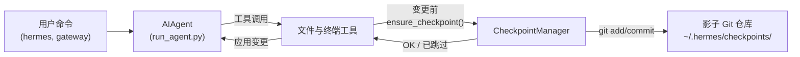

# 检查点与 `/rollback`

Hermes Agent 在**破坏性操作**之前自动为你的项目创建快照，并允许你用一条命令恢复。检查点**默认启用** —— 没有文件变更工具触发时零开销。

这个安全网由内部 **Checkpoint Manager** 驱动，它在 `~/.hermes/checkpoints/` 下维护一个独立的影子 Git 仓库 —— 你真正的项目 `.git` 永远不会被触碰。

## 什么操作会触发检查点

检查点在以下操作前自动创建：

- **文件工具** — `write_file` 和 `patch`
- **破坏性终端命令** — `rm`、`mv`、`sed -i`、`truncate`、`shred`、输出重定向（`>`）以及 `git reset`/`clean`/`checkout`

Agent 每轮对话**每个目录最多创建一个检查点**，因此长时间运行的会话不会产生大量快照。

## 快速参考

| 命令 | 说明 |
|------|------|
| `/rollback` | 列出所有检查点及变更统计 |
| `/rollback <N>` | 恢复到检查点 N（同时撤销最后一轮对话） |
| `/rollback diff <N>` | 预览检查点 N 与当前状态之间的差异 |
| `/rollback <N> <file>` | 从检查点 N 恢复单个文件 |

## 检查点的工作原理

高层概览：

- Hermes 检测工具即将**修改文件**时。
- 每轮对话一次（每个目录），它会：
  - 为文件解析一个合理的项目根目录。
  - 初始化或复用一个与该目录关联的**影子 Git 仓库**。
  - 暂存并提交当前状态，附带简短的人类可读原因。
- 这些提交形成检查点历史，你可以通过 `/rollback` 检查和恢复。



## 配置

检查点默认启用。在 `~/.hermes/config.yaml` 中配置：

```yaml
checkpoints:
  enabled: true          # 主开关（默认：true）
  max_snapshots: 50      # 每个目录的最大检查点数
```

禁用：

```yaml
checkpoints:
  enabled: false
```

禁用时，Checkpoint Manager 是空操作，永不尝试 Git 操作。

## 列出检查点

在 CLI 会话中：

```
/rollback
```

Hermes 返回格式化的列表，显示变更统计：

```text
📸 Checkpoints for /path/to/project:

  1. 4270a8c  2026-03-16 04:36  before patch  (1 file, +1/-0)
  2. eaf4c1f  2026-03-16 04:35  before write_file
  3. b3f9d2e  2026-03-16 04:34  before terminal: sed -i s/old/new/ config.py  (1 file, +1/-1)

  /rollback <N>             恢复到检查点 N
  /rollback diff <N>        预览自检查点 N 以来的变更
  /rollback <N> <file>      从检查点 N 恢复单个文件
```

每条记录显示：

- 短哈希
- 时间戳
- 原因（什么触发了快照）
- 变更摘要（修改的文件数、插入/删除）

## 用 `/rollback diff` 预览变更

在确认恢复之前，预览自检查点以来的变更：

```
/rollback diff 1
```

这会显示 Git 差异统计摘要，后跟实际差异：

```text
test.py | 2 +-
 1 file changed, 1 insertion(+), 1 deletion(-)

diff --git a/test.py b/test.py
--- a/test.py
+++ b/test.py
@@ -1 +1 @@
-print('original content')
+print('modified content')
```

长差异被限制在 80 行以内，避免终端被淹没。

## 用 `/rollback` 恢复

通过编号恢复到检查点：

```
/rollback 1
```

在幕后，Hermes 会：

1. 验证目标提交存在于影子仓库中。
2. 对当前状态拍摄**回滚前快照**，以便你之后可以"撤销撤销"。
3. 恢复工作目录中被跟踪的文件。
4. **撤销最后一轮对话**，使 Agent 的上下文与恢复的文件系统状态匹配。

成功时：

```text
✅ Restored to checkpoint 4270a8c5: before patch
A pre-rollback snapshot was saved automatically.
(^_^)b Undid 4 message(s). Removed: "Now update test.py to ..."
  4 message(s) remaining in history.
  Chat turn undone to match restored file state.
```

对话撤销确保 Agent 不会"记住"已被回滚的变更，避免下一轮产生混淆。

## 单文件恢复

只从检查点恢复一个文件，不影响目录中的其余文件：

```
/rollback 1 src/broken_file.py
```

当 Agent 修改了多个文件但只有一个需要还原时，这很有用。

## 安全与性能保障

为保持检查点安全且快速，Hermes 应用多项保护措施：

- **Git 可用性** — 如果 `PATH` 中找不到 `git`，检查点透明禁用。
- **目录范围** — Hermes 跳过过于宽泛的目录（根目录 `/`、主目录 `$HOME`）。
- **仓库大小** — 超过 50,000 个文件的目录会被跳过，以避免缓慢的 Git 操作。
- **无变更快照** — 如果自上次快照以来没有变更，检查点被跳过。
- **非致命错误** — Checkpoint Manager 内的所有错误在 debug 级别记录；你的工具继续运行。

## 检查点的存储位置

所有影子仓库存储在：

```text
~/.hermes/checkpoints/
  ├── <hash1>/   # 一个工作目录的影子 Git 仓库
  ├── <hash2>/
  └── ...
```

每个 `<hash>` 由工作目录的绝对路径派生。在每个影子仓库内你会发现：

- 标准 Git 内部结构（`HEAD`、`refs/`、`objects/`）
- 一个包含精选忽略列表的 `info/exclude` 文件
- 一个指回原始项目根目录的 `HERMES_WORKDIR` 文件

通常你不需要手动操作这些。

## 最佳实践

- **保持检查点启用** — 默认开启，没有文件修改时零开销。
- **恢复前使用 `/rollback diff`** — 预览将要变更的内容以选择正确的检查点。
- **撤销 Agent 驱动的变更时使用 `/rollback` 而非 `git reset`**。
- **结合 Git Worktree 实现最大安全性** — 将每个 Hermes 会话放在自己的 Worktree/分支中，以检查点作为额外保护层。

关于在同一仓库上并行运行多个 Agent，参见 [Git Worktree](./git-worktrees.md) 指南。

---
> 📝 本文由 AI 翻译，如有疑问请参考[英文原版](/docs/user-guide/checkpoints-and-rollback)
