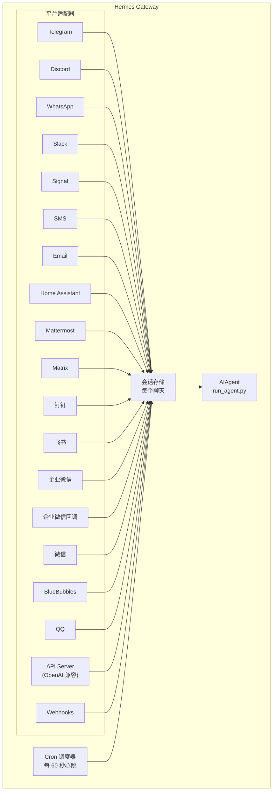

# 消息 Gateway

通过 Telegram、Discord、Slack、WhatsApp、Signal、SMS、Email、Home Assistant、Mattermost、Matrix、钉钉、飞书、企业微信、微信、BlueBubbles（iMessage）、QQ 或浏览器与 Hermes 聊天。Gateway 是一个单一后台进程，连接到你所有已配置的平台，处理会话、运行 Cron 任务和投递语音消息。

完整的语音功能 — 包括 CLI 麦克风模式、消息中的语音回复和 Discord 语音频道对话 — 参见 [Voice Mode](/docs/user-guide/features/voice-mode) 和[使用语音模式与 Hermes](/docs/guides/use-voice-mode-with-hermes)。

## 平台对比

| 平台 | 语音 | 图片 | 文件 | 线程 | 反应 | 输入指示 | 流式 |
|----------|:-----:|:------:|:-----:|:-------:|:---------:|:------:|:---------:|
| Telegram | ✅ | ✅ | ✅ | ✅ | — | ✅ | ✅ |
| Discord | ✅ | ✅ | ✅ | ✅ | ✅ | ✅ | ✅ |
| Slack | ✅ | ✅ | ✅ | ✅ | ✅ | ✅ | ✅ |
| WhatsApp | — | ✅ | ✅ | — | — | ✅ | ✅ |
| Signal | — | ✅ | ✅ | — | — | ✅ | ✅ |
| SMS | — | — | — | — | — | — | — |
| Email | — | ✅ | ✅ | ✅ | — | — | — |
| Home Assistant | — | — | — | — | — | — | — |
| Mattermost | ✅ | ✅ | ✅ | ✅ | — | ✅ | ✅ |
| Matrix | ✅ | ✅ | ✅ | ✅ | ✅ | ✅ | ✅ |
| 钉钉 | — | ✅ | ✅ | — | ✅ | — | ✅ |
| 飞书 | ✅ | ✅ | ✅ | ✅ | ✅ | ✅ | ✅ |
| 企业微信 | ✅ | ✅ | ✅ | — | — | ✅ | ✅ |
| 企业微信回调 | — | — | — | — | — | — | — |
| 微信 | ✅ | ✅ | ✅ | — | — | ✅ | ✅ |
| BlueBubbles | — | ✅ | ✅ | — | ✅ | ✅ | — |
| QQ | ✅ | ✅ | ✅ | — | — | ✅ | — |

**语音** = TTS 音频回复和/或语音消息转录。**图片** = 发送/接收图片。**文件** = 发送/接收文件附件。**线程** = 线程化对话。**反应** = 消息上的 Emoji 反应。**输入指示** = 处理时的输入状态。**流式** = 通过编辑实现渐进式消息更新。

## 架构



每个平台适配器接收消息，通过每聊天的会话存储路由，并分发给 AIAgent 处理。Gateway 还运行 Cron 调度器，每 60 秒心跳一次以执行到期的任务。

## 快速设置

配置消息平台最简单的方式是交互式向导：

```bash
hermes gateway setup        # 交互式配置所有消息平台
```

它会引导你用方向键选择配置每个平台，显示哪些平台已配置，并在完成后提供启动/重启 Gateway 的选项。

## Gateway 命令

```bash
hermes gateway              # 前台运行
hermes gateway setup        # 交互式配置消息平台
hermes gateway install      # 安装为用户服务（Linux）/ launchd 服务（macOS）
sudo hermes gateway install --system   # 仅 Linux：安装为开机系统服务
hermes gateway start        # 启动默认服务
hermes gateway stop         # 停止默认服务
hermes gateway status       # 检查默认服务状态
hermes gateway status --system         # 仅 Linux：查看系统服务状态
```

## 聊天命令（消息平台内）

| 命令 | 说明 |
|---------|-------------|
| `/new` 或 `/reset` | 开始新的对话 |
| `/model [provider:model]` | 显示或更改模型（支持 `provider:model` 语法） |
| `/provider` | 显示可用 Provider 及认证状态 |
| `/personality [name]` | 设置个性 |
| `/retry` | 重试上一条消息 |
| `/undo` | 撤销上一轮对话 |
| `/status` | 显示会话信息 |
| `/stop` | 停止正在运行的 Agent |
| `/approve` | 批准待处理的危险命令 |
| `/deny` | 拒绝待处理的危险命令 |
| `/sethome` | 将当前聊天设为主频道 |
| `/compress` | 手动压缩对话上下文 |
| `/title [name]` | 设置或显示会话标题 |
| `/resume [name]` | 恢复之前命名的会话 |
| `/usage` | 显示本会话的 Token 使用量 |
| `/insights [days]` | 显示使用洞察和分析 |
| `/reasoning [level\|show\|hide]` | 更改推理力度或切换推理显示 |
| `/voice [on\|off\|tts\|join\|leave\|status]` | 控制消息语音回复和 Discord 语音频道行为 |
| `/rollback [number]` | 列出或恢复文件系统检查点 |
| `/background <prompt>` | 在独立后台会话中运行提示 |
| `/reload-mcp` | 从配置重新加载 MCP 服务器 |
| `/update` | 更新 Hermes Agent 到最新版本 |
| `/help` | 显示可用命令 |
| `/<skill-name>` | 调用任何已安装的 Skill |

## 会话管理

### 会话持久化

会话在消息之间持久保存，直到重置。Agent 会记住你的对话上下文。

### 重置策略

会话根据可配置的策略重置：

| 策略 | 默认值 | 说明 |
|--------|---------|-------------|
| 每日 | 凌晨 4:00 | 每天特定时间重置 |
| 空闲 | 1440 分钟 | 空闲 N 分钟后重置 |
| 两者 | （组合） | 先触发的生效 |

在 `~/.hermes/gateway.json` 中配置每平台覆盖：

```json
{
  "reset_by_platform": {
    "telegram": { "mode": "idle", "idle_minutes": 240 },
    "discord": { "mode": "idle", "idle_minutes": 60 }
  }
}
```

## 安全

**默认情况下，Gateway 拒绝所有不在白名单或未通过 DM 配对的用户。** 这是拥有终端访问权限的 Bot 的安全默认设置。

```bash
# 限制为特定用户（推荐）：
TELEGRAM_ALLOWED_USERS=123456789,987654321
DISCORD_ALLOWED_USERS=123456789012345678
SIGNAL_ALLOWED_USERS=+155****4567,+155****6543
SMS_ALLOWED_USERS=+155****4567,+155****6543
EMAIL_ALLOWED_USERS=trusted@example.com,colleague@work.com
MATTERMOST_ALLOWED_USERS=3uo8dkh1p7g1mfk49ear5fzs5c
MATRIX_ALLOWED_USERS=@alice:matrix.org
DINGTALK_ALLOWED_USERS=user-id-1
FEISHU_ALLOWED_USERS=ou_xxxxxxxx,ou_yyyyyyyy
WECOM_ALLOWED_USERS=user-id-1,user-id-2
WECOM_CALLBACK_ALLOWED_USERS=user-id-1,user-id-2

# 或允许
GATEWAY_ALLOWED_USERS=123456789,987654321

# 或明确允许所有用户（不推荐用于有终端访问权限的 Bot）：
GATEWAY_ALLOW_ALL_USERS=true
```

### DM 配对（白名单的替代方案）

无需手动配置用户 ID，未知用户在给 Bot 发私信时会收到一次性配对码：

```bash
# 用户看到："Pairing code: XKGH5N7P"
# 你批准他们：
hermes pairing approve telegram XKGH5N7P

# 其他配对命令：
hermes pairing list          # 查看待处理 + 已批准用户
hermes pairing revoke telegram 123456789  # 移除访问权限
```

配对码 1 小时后过期，有速率限制，使用加密随机性。

## 中断 Agent

Agent 工作时发送任何消息即可中断。关键行为：

- **正在执行的终端命令立即被终止**（先 SIGTERM，1 秒后 SIGKILL）
- **工具调用被取消** — 只运行当前正在执行的那个，其余被跳过
- **多条消息被合并** — 中断期间发送的消息会合并为一个提示
- **`/stop` 命令** — 中断但不排队后续消息

## 工具进度通知

在 `~/.hermes/config.yaml` 中控制显示多少工具活动：

```yaml
display:
  tool_progress: all    # off | new | all | verbose
  tool_progress_command: false  # 设为 true 以在消息中启用 /verbose
```

启用后，Bot 在工作时发送状态消息：

```text
💻 `ls -la`...
🔍 web_search...
📄 web_extract...
🐍 execute_code...
```

## 后台会话

在独立后台会话中运行提示，让 Agent 独立处理，同时你的主聊天保持可用：

```
/background 检查集群中的所有服务器并报告任何宕机的
```

Hermes 立即确认：

```
🔄 后台任务已启动: "检查集群中的所有服务器..."
   Task ID: bg_143022_a1b2c3
```

### 工作原理

每个 `/background` 提示生成一个**独立的 Agent 实例**异步运行：

- **隔离会话** — 后台 Agent 有自己的会话和对话历史。它不了解你当前聊天的上下文，只接收你提供的提示。
- **相同配置** — 继承你当前的模型、Provider、工具集、推理设置和 Provider 路由。
- **非阻塞** — 你的主聊天保持完全可交互。在它工作时，发送消息、运行其他命令或启动更多后台任务。
- **结果投递** — 任务完成时，结果发送回你发出命令的**同一聊天或频道**，前缀为 "✅ 后台任务完成"。如果失败，你会看到 "❌ 后台任务失败" 及错误信息。

### 后台进程通知

当运行后台会话的 Agent 使用 `terminal(background=true)` 启动长时间运行的进程（服务器、构建等）时，Gateway 可以向你的聊天推送状态更新。在 `~/.hermes/config.yaml` 中通过 `display.background_process_notifications` 控制：

```yaml
display:
  background_process_notifications: all    # all | result | error | off
```

| 模式 | 你收到的内容 |
|------|-----------------|
| `all` | 运行输出更新**和**最终完成消息（默认） |
| `result` | 仅最终完成消息（无论退出码） |
| `error` | 仅在退出码非零时显示最终消息 |
| `off` | 完全不显示进程监控消息 |

你也可以通过环境变量设置：

```bash
HERMES_BACKGROUND_NOTIFICATIONS=result
```

### 使用场景

- **服务器监控** — "/background 检查所有服务的健康状态并提醒我任何宕机的"
- **长时间构建** — "/background 构建并部署预发布环境" 同时你继续聊天
- **研究任务** — "/background 调查竞争对手定价并汇总成表格"
- **文件操作** — "/background 将 ~/Downloads 中的照片按日期整理到文件夹"

:::tip
消息平台上的后台任务是即发即忘的 — 你不需要等待或检查它们。任务完成时结果会自动到达同一聊天。
:::

## 服务管理

### Linux（systemd）

```bash
hermes gateway install               # 安装为用户服务
hermes gateway start                 # 启动服务
hermes gateway stop                  # 停止服务
hermes gateway status                # 检查状态
journalctl --user -u hermes-gateway -f  # 查看日志

# 启用驻留（注销后继续运行）
sudo loginctl enable-linger $USER

# 或安装一个仍以你的用户运行的开机系统服务
sudo hermes gateway install --system
sudo hermes gateway start --system
sudo hermes gateway status --system
journalctl -u hermes-gateway -f
```

在笔记本和开发机上使用用户服务。在 VPS 或无头主机上使用系统服务，它们应在启动时自动恢复而不依赖 systemd linger。

避免同时安装用户和系统 Gateway 单元，除非你确实需要。如果 Hermes 检测到两者会发出警告，因为 start/stop/status 行为会变得不明确。

:::info 多个安装
如果你在同一台机器上运行多个 Hermes 安装（使用不同的 `HERMES_HOME` 目录），每个都有自己的 systemd 服务名。默认的 `~/.hermes` 使用 `hermes-gateway`；其他安装使用 `hermes-gateway-<hash>`。`hermes gateway` 命令会自动针对你当前 `HERMES_HOME` 的正确服务。
:::

### macOS（launchd）

```bash
hermes gateway install               # 安装为 launchd Agent
hermes gateway start                 # 启动服务
hermes gateway stop                  # 停止服务
hermes gateway status                # 检查状态
tail -f ~/.hermes/logs/gateway.log   # 查看日志
```

生成的 plist 位于 `~/Library/LaunchAgents/ai.hermes.gateway.plist`。它包含三个环境变量：

- **PATH** — 安装时的完整 shell PATH，venv `bin/` 和 `node_modules/.bin` 前置。这确保用户安装的工具（Node.js、ffmpeg 等）可用于 Gateway 子进程如 WhatsApp 桥接。
- **VIRTUAL_ENV** — 指向 Python 虚拟环境，以便工具正确解析包。
- **HERMES_HOME** — 将 Gateway 限定在你的 Hermes 安装。

:::tip 安装后的 PATH 更改
launchd plist 是静态的 — 如果你在设置 Gateway 后安装了新工具（如通过 nvm 的新 Node.js 版本或通过 Homebrew 的 ffmpeg），重新运行 `hermes gateway install` 以捕获更新的 PATH。Gateway 会检测过期的 plist 并自动重新加载。
:::

:::info 多个安装
与 Linux systemd 服务一样，每个 `HERMES_HOME` 目录有自己的 launchd 标签。默认 `~/.hermes` 使用 `ai.hermes.gateway`；其他安装使用 `ai.hermes.gateway-<suffix>`。
:::

## 平台特定工具集

每个平台有自己的工具集：

| 平台 | 工具集 | 能力 |
|----------|---------|--------------|
| CLI | `hermes-cli` | 完整访问 |
| Telegram | `hermes-telegram` | 完整工具包括终端 |
| Discord | `hermes-discord` | 完整工具包括终端 |
| WhatsApp | `hermes-whatsapp` | 完整工具包括终端 |
| Slack | `hermes-slack` | 完整工具包括终端 |
| Signal | `hermes-signal` | 完整工具包括终端 |
| SMS | `hermes-sms` | 完整工具包括终端 |
| Email | `hermes-email` | 完整工具包括终端 |
| Home Assistant | `hermes-homeassistant` | 完整工具 + HA 设备控制（ha_list_entities、ha_get_state、ha_call_service、ha_list_services） |
| Mattermost | `hermes-mattermost` | 完整工具包括终端 |
| Matrix | `hermes-matrix` | 完整工具包括终端 |
| 钉钉 | `hermes-dingtalk` | 完整工具包括终端 |
| 飞书 | `hermes-feishu` | 完整工具包括终端 |
| 企业微信 | `hermes-wecom` | 完整工具包括终端 |
| 企业微信回调 | `hermes-wecom-callback` | 完整工具包括终端 |
| 微信 | `hermes-weixin` | 完整工具包括终端 |
| BlueBubbles | `hermes-bluebubbles` | 完整工具包括终端 |
| QQBot | `hermes-qqbot` | 完整工具包括终端 |
| API Server | `hermes`（默认） | 完整工具包括终端 |
| Webhooks | `hermes-webhook` | 完整工具包括终端 |

## 下一步

- [Telegram 设置](telegram.md)
- [Discord 设置](discord.md)
- [Slack 设置](slack.md)
- [WhatsApp 设置](whatsapp.md)
- [Signal 设置](signal.md)
- [SMS 设置 (Twilio)](sms.md)
- [Email 设置](email.md)
- [Home Assistant 集成](homeassistant.md)
- [Mattermost 设置](mattermost.md)
- [Matrix 设置](matrix.md)
- [钉钉设置](dingtalk.md)
- [飞书设置](feishu.md)
- [企业微信设置](wecom.md)
- [企业微信回调设置](wecom-callback.md)
- [微信设置](weixin.md)
- [BlueBubbles 设置 (iMessage)](bluebubbles.md)
- [QQBot 设置](qqbot.md)
- [Open WebUI + API Server](open-webui.md)
- [Webhooks](webhooks.md)

---
> 📝 本文由 AI 翻译，如有疑问请参考[英文原版](/docs/user-guide/messaging)
