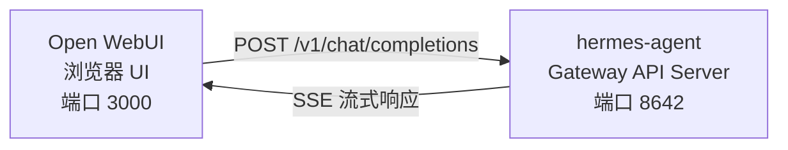

# Open WebUI 集成

[Open WebUI](https://github.com/open-webui/open-webui)（126k★）是最受欢迎的自托管 AI 聊天界面。借助 Hermes Agent 内置的 API Server，你可以使用 Open WebUI 作为 Agent 的精美 Web 前端 — 包含对话管理、用户账户和现代聊天界面。

## 架构



Open WebUI 连接到 Hermes Agent 的 API Server，就像连接到 OpenAI 一样。你的 Agent 使用完整工具集处理请求 — 终端、文件操作、Web 搜索、记忆、Skill — 并返回最终响应。

Open WebUI 与 Hermes 是服务器到服务器通信，因此你不需要为此集成配置 `API_SERVER_CORS_ORIGINS`。

## 快速设置

### 1. 启用 API Server

添加到 `~/.hermes/.env`：

```bash
API_SERVER_ENABLED=true
API_SERVER_KEY=your-secret-key
```

### 2. 启动 Hermes Agent Gateway

```bash
hermes gateway
```

你应该看到：

```
[API Server] API server listening on http://127.0.0.1:8642
```

### 3. 启动 Open WebUI

```bash
docker run -d -p 3000:8080 \
  -e OPENAI_API_BASE_URL=http://host.docker.internal:8642/v1 \
  -e OPENAI_API_KEY=your-secret-key \
  --add-host=host.docker.internal:host-gateway \
  -v open-webui:/app/backend/data \
  --name open-webui \
  --restart always \
  ghcr.io/open-webui/open-webui:main
```

### 4. 打开 UI

访问 `http://localhost:3000`。创建管理员账户（第一个用户成为管理员）。你应该在模型下拉列表中看到你的 Agent（以你的 Profile 命名，默认 Profile 为 **hermes-agent**）。开始聊天！

## Docker Compose 设置

对于更持久的部署，创建 `docker-compose.yml`：

```yaml
services:
  open-webui:
    image: ghcr.io/open-webui/open-webui:main
    ports:
      - "3000:8080"
    volumes:
      - open-webui:/app/backend/data
    environment:
      - OPENAI_API_BASE_URL=http://host.docker.internal:8642/v1
      - OPENAI_API_KEY=your-secret-key
    extra_hosts:
      - "host.docker.internal:host-gateway"
    restart: always

volumes:
  open-webui:
```

然后：

```bash
docker compose up -d
```

## 通过管理 UI 配置

如果你更喜欢通过 UI 而非环境变量配置连接：

1. 登录 Open WebUI `http://localhost:3000`
2. 点击你的**头像** → **Admin Settings**
3. 进入 **Connections**
4. 在 **OpenAI API** 下，点击**扳手图标**（管理）
5. 点击 **+ Add New Connection**
6. 输入：
   - **URL**：`http://host.docker.internal:8642/v1`
   - **API Key**：你的密钥或任何非空值（如 `not-needed`）
7. 点击**对勾**验证连接
8. **保存**

你的 Agent 模型应该出现在模型下拉列表中（以你的 Profile 命名，默认 Profile 为 **hermes-agent**）。

:::warning
环境变量只在 Open WebUI **首次启动**时生效。之后，连接设置存储在其内部数据库中。要稍后更改，使用管理 UI 或删除 Docker 卷并重新开始。
:::

## API 类型：Chat Completions vs Responses

Open WebUI 连接后端时支持两种 API 模式：

| 模式 | 格式 | 何时使用 |
|------|--------|-------------|
| **Chat Completions**（默认） | `/v1/chat/completions` | 推荐。开箱即用。 |
| **Responses**（实验性） | `/v1/responses` | 用于通过 `previous_response_id` 实现服务端对话状态。 |

### 使用 Chat Completions（推荐）

这是默认模式，无需额外配置。Open WebUI 发送标准 OpenAI 格式请求，Hermes Agent 相应响应。每个请求包含完整对话历史。

### 使用 Responses API

使用 Responses API 模式：

1. 进入 **Admin Settings** → **Connections** → **OpenAI** → **Manage**
2. 编辑你的 hermes-agent 连接
3. 将 **API Type** 从 "Chat Completions" 改为 **"Responses (Experimental)"**
4. 保存

使用 Responses API 时，Open WebUI 以 Responses 格式发送请求（`input` 数组 + `instructions`），Hermes Agent 可以通过 `previous_response_id` 跨轮次保留完整工具调用历史。当 `stream: true` 时，Hermes 还会流式传输原生的 `function_call` 和 `function_call_output` 项，这在渲染 Responses 事件的客户端中启用自定义结构化工具调用 UI。

:::note
Open WebUI 目前即使在 Responses 模式下也在客户端管理对话历史 — 它在每个请求中发送完整消息历史，而非使用 `previous_response_id`。Responses 模式当前的主要优势是结构化事件流：文本增量、`function_call` 和 `function_call_output` 项以 OpenAI Responses SSE 事件到达，而非 Chat Completions 块。
:::

## 工作原理

当你在 Open WebUI 中发送消息时：

1. Open WebUI 发送 `POST /v1/chat/completions` 请求，附带你的消息和对话历史
2. Hermes Agent 创建一个具有完整工具集的 AIAgent 实例
3. Agent 处理你的请求 — 可能调用工具（终端、文件操作、Web 搜索等）
4. 工具执行时，**内联进度消息流式传输到 UI**，你可以看到 Agent 在做什么（如 `` `💻 ls -la` ``、`` `🔍 Python 3.12 release` ``）
5. Agent 的最终文本响应流式传回 Open WebUI
6. Open WebUI 在其聊天界面中显示响应

你的 Agent 可以访问与 CLI 或 Telegram 相同的所有工具和能力 — 唯一的区别是前端。

:::tip 工具进度
启用流式传输（默认）后，工具运行时你会看到简短的内联指示器 — 工具 Emoji 及其关键参数。这些出现在 Agent 最终答案之前的响应流中，让你了解幕后发生了什么。
:::

## 配置参考

### Hermes Agent（API Server）

| 变量 | 默认值 | 说明 |
|----------|---------|-------------|
| `API_SERVER_ENABLED` | `false` | 启用 API Server |
| `API_SERVER_PORT` | `8642` | HTTP 服务器端口 |
| `API_SERVER_HOST` | `127.0.0.1` | 绑定地址 |
| `API_SERVER_KEY` | _（必需）_ | 认证 Bearer Token。需与 `OPENAI_API_KEY` 匹配。 |

### Open WebUI

| 变量 | 说明 |
|----------|-------------|
| `OPENAI_API_BASE_URL` | Hermes Agent 的 API URL（包含 `/v1`） |
| `OPENAI_API_KEY` | 必须非空。需与你的 `API_SERVER_KEY` 匹配。 |

## 故障排除

### 下拉列表中没有模型

- **检查 URL 有 `/v1` 后缀**：`http://host.docker.internal:8642/v1`（不是 `:8642`）
- **验证 Gateway 正在运行**：`curl http://localhost:8642/health` 应返回 `{"status": "ok"}`
- **检查模型列表**：`curl http://localhost:8642/v1/models` 应返回包含 `hermes-agent` 的列表
- **Docker 网络**：在 Docker 内部，`localhost` 指容器本身，不是你的主机。使用 `host.docker.internal` 或 `--network=host`。

### 连接测试通过但没有模型加载

这几乎总是缺少 `/v1` 后缀。Open WebUI 的连接测试是基本连通性检查 — 它不验证模型列表是否工作。

### 响应时间很长

Hermes Agent 可能在执行多个工具调用（读取文件、运行命令、搜索 Web）后才会产生最终响应。这对复杂查询是正常的。响应在 Agent 完成后一次性出现。

### "Invalid API key" 错误

确保 Open WebUI 中的 `OPENAI_API_KEY` 与 Hermes Agent 中的 `API_SERVER_KEY` 匹配。

## 使用 Profile 的多用户设置

要为每个用户运行独立的 Hermes 实例 — 各有自己的配置、记忆和 Skill — 使用 [Profile](/docs/user-guide/profiles)。每个 Profile 在不同端口上运行自己的 API Server，并自动将 Profile 名称作为模型名称在 Open WebUI 中广播。

### 1. 创建 Profile 并配置 API Server

```bash
hermes profile create alice
hermes -p alice config set API_SERVER_ENABLED true
hermes -p alice config set API_SERVER_PORT 8643
hermes -p alice config set API_SERVER_KEY alice-secret

hermes profile create bob
hermes -p bob config set API_SERVER_ENABLED true
hermes -p bob config set API_SERVER_PORT 8644
hermes -p bob config set API_SERVER_KEY bob-secret
```

### 2. 启动每个 Gateway

```bash
hermes -p alice gateway &
hermes -p bob gateway &
```

### 3. 在 Open WebUI 中添加连接

在 **Admin Settings** → **Connections** → **OpenAI API** → **Manage** 中，每个 Profile 添加一个连接：

| 连接 | URL | API Key |
|-----------|-----|---------|
| Alice | `http://host.docker.internal:8643/v1` | `alice-secret` |
| Bob | `http://host.docker.internal:8644/v1` | `bob-secret` |

模型下拉列表会显示 `alice` 和 `bob` 作为不同模型。你可以通过管理面板将模型分配给 Open WebUI 用户，给每个用户自己的隔离 Hermes Agent。

:::tip 自定义模型名称
模型名称默认为 Profile 名称。要覆盖，在 Profile 的 `.env` 中设置 `API_SERVER_MODEL_NAME`：
```bash
hermes -p alice config set API_SERVER_MODEL_NAME "Alice's Agent"
```
:::

## Linux Docker（无 Docker Desktop）

在没有 Docker Desktop 的 Linux 上，`host.docker.internal` 默认无法解析。选项：

```bash
# 选项 1：添加主机映射
docker run --add-host=host.docker.internal:host-gateway ...

# 选项 2：使用主机网络
docker run --network=host -e OPENAI_API_BASE_URL=http://localhost:8642/v1 ...

# 选项 3：使用 Docker 网桥 IP
docker run -e OPENAI_API_BASE_URL=http://172.17.0.1:8642/v1 ...
```

---
> 📝 本文由 AI 翻译，如有疑问请参考[英文原版](/docs/user-guide/messaging/open-webui)
